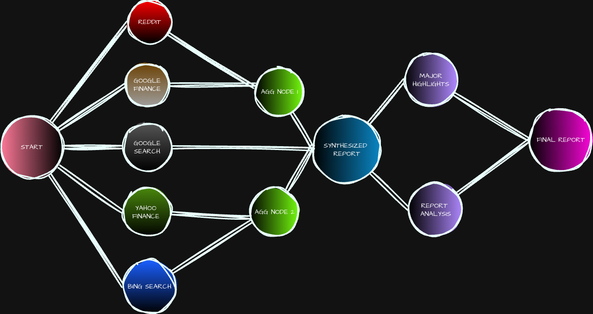
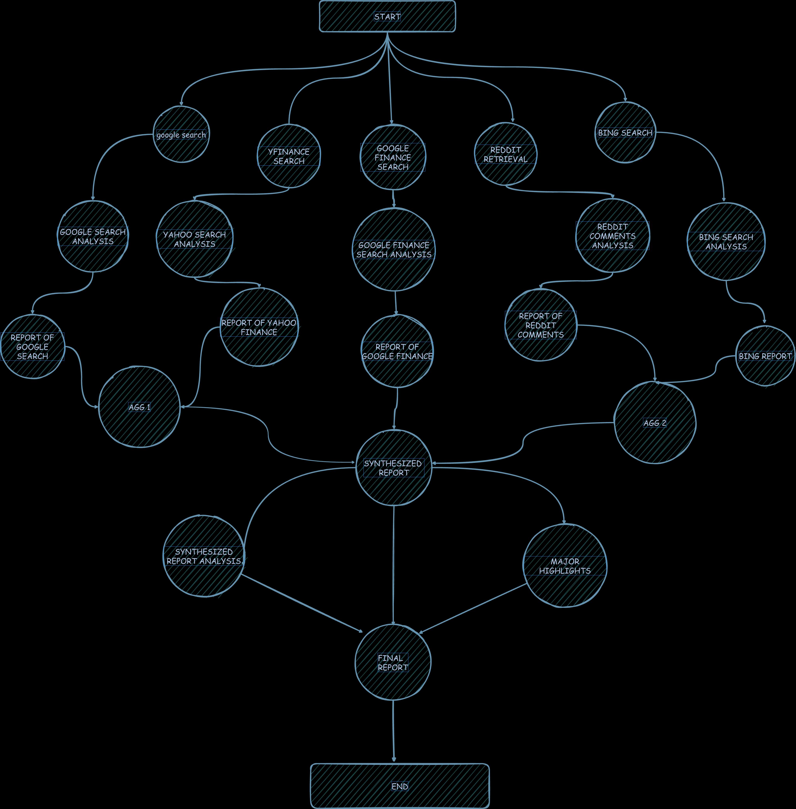

# Advanced-Research-Agent

[](https://opensource.org/licenses/MIT)
[](https://github.com/divyyadav/Advanced-Research-Agent)
[](https://www.python.org/downloads/)

An autonomous AI agent that performs comprehensive research on any given topic by leveraging multiple data sources, synthesizing the information, and generating a detailed, insightful report.

## Overview

In today's information-rich world, conducting thorough research is a time-consuming and often overwhelming task. The Advanced Research Agent is designed to automate this entire process. It intelligently scours the web, financial data sources, and community forums to gather a holistic view of any subject. By analyzing and synthesizing this data, it produces a final report complete with major highlights, saving you hours of manual work and providing you with actionable insights.

## How It Works

The agent follows a sophisticated, multi-layered workflow to ensure the research is both broad and deep. The process is visualized below:

### High-Level Flow



### Detailed Architecture



The workflow consists of the following stages:

1.  **Multi-Source Data Retrieval**: The agent initiates parallel searches across a variety of sources to gather a wide spectrum of information. These sources include:
    *   **Google Search**: For general web-based information and articles.
    *   **Bing Search**: As an alternative search engine to diversify results.
    *   **Google Finance & Yahoo Finance**: For financial data, market trends, and news.
    *   **Reddit**: To tap into community discussions, opinions, and niche insights.

2.  **In-depth Analysis**: Each piece of retrieved data is independently analyzed to extract relevant information and key points.

3.  **Report Aggregation**: The analyzed data from various sources is compiled into preliminary reports. These reports are then aggregated to form a cohesive collection of findings.

4.  **Information Synthesis**: The core of the agent's intelligence lies in its ability to synthesize the aggregated information. It cross-references data, identifies patterns, and creates a unified, comprehensive report.

5.  **Final Report Generation**: The synthesized data is further processed to:
    *   **Extract Major Highlights**: Pulling out the most critical and impactful pieces of information for a quick overview.
    *   **Perform a Final Analysis**: A deeper analysis of the synthesized report to draw conclusions and insights.
    *   **Generate the Final Report**: The culmination of the entire process, a well-structured, detailed, and insightful document ready for use.

## Features

*   **Autonomous Operation**: Simply provide a topic, and the agent handles the rest.
*   **Multi-Source Intelligence**: Gathers data from search engines, financial sites, and social forums for a 360-degree view.
*   **Parallel Processing**: Leverages parallel workflows to speed up the research process significantly.
*   **Deep Synthesis**: Goes beyond simple data aggregation to create a truly synthesized and coherent understanding of the topic.
*   **Actionable Insights**: Delivers a final report with clear highlights and analysis.

## Getting Started

To get the Advanced Research Agent up and running, follow these steps.

### Prerequisites

Make sure you have Python 3.9+ installed on your system. You will also need to install the required dependencies.

```bash
pip install -r requirements.txt
```

### Installation

1.  Clone the repository:
    ```bash
    git clone https://github.com/divyyadav/Advanced-Research-Agent.git
    cd Advanced-Research-Agent
    ```

2.  Set up your environment variables. You'll need API keys for the various services used by the agent. Rename `.env.example` to `.env` and fill in your credentials.


### Installation

1.  Clone the repository:
    n script with your desired topic:

```bash
python main.py --topic "The future of renewable energy
"
```

2.  Set up your environment variables. You'll need API keys for the various services used by the agent. Rename `.env.example` to `.env` and fill in your credentials.

```bash
GOOGLE_API_KEY=your_google_api_key
BING_API_KEY=your_bing_api_key
```

### Usage

To start a research task, run the main script with your desired topic:


The agent will begin the research process, and you can monitor its progress through the console. The final report will be saved in the `reports/` directory.

## Contributing

Contributions are what make the open-source community such an amazing place to learn, inspire, and create. Any contributions you make are **greatly appreciated**.

Please refer to our [contributing guidelines](CONTRIBUTING.md) for more information.

## License

This project is licensed under the MIT License. See the `LICENSE` file for more details.
```